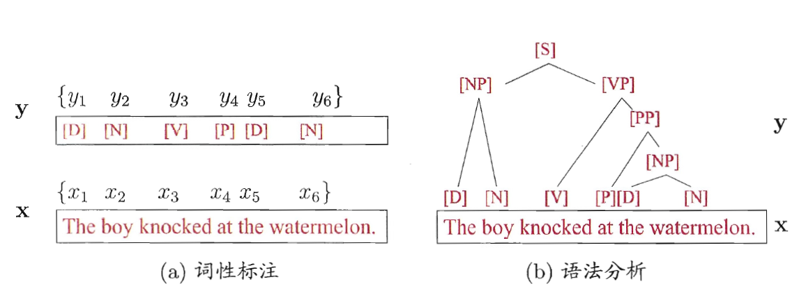
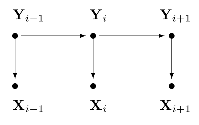
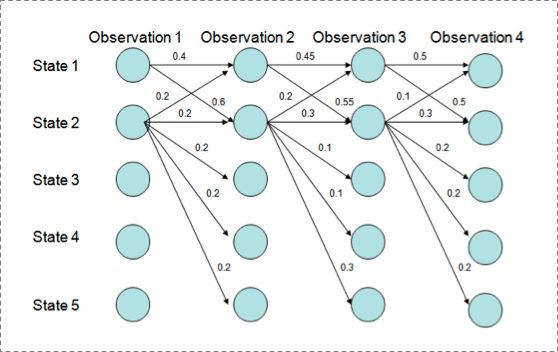
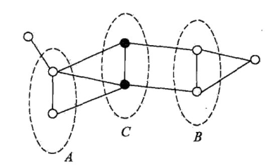
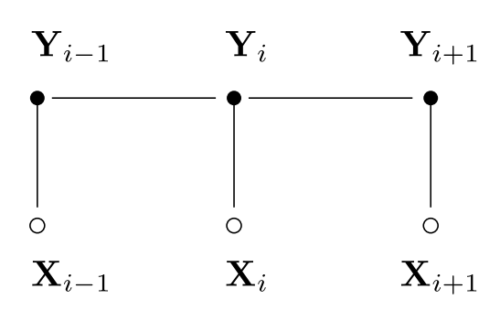

# Conditional Random Fields

Yifan Zhang

[TOC]

## 0. Preliminaries
Introduction to Statistical Learning

### 0.1 Supervised Learning (1 slide)

监督学习（ supervised learning ）的任务是学习一个模型，使模型能够对任意给定的输入，对其相应的输出做出一个好的预测.

+ Input Space
+ Output Space
+ **Feature Space**: 每个具体的输入是一个实例 (instance)，通常由特征向量 (feature vector) 表示. 这时，所有特征向量存在的空间称为特征空间 (feature space). 特征空间的每一维对应于一个特征.
+  **Joint Probability Distribution**: 监督学习假设输入与输出的随机变量 $X$ 和 $Y$ 遵循联合概率分布 $P(X, Y)$. $P(X,Y)$ 表示分布密度函数. 注意，在学习过程中，假定这一联合概率分布存在，但对学习系统来说，联合概率分布的具体定义是未知.
+ Hypothesis Space

### 0.2 Elements of Statistical Learning

+ Loss Function: 度量预测错误的程度
+ Risk Function: 模型关于联合分布 $P(X,Y)$ 的平均意义下的损失
+ Emprical Risk: 模型关于训练数据集的平均损失

### 0.3 Generative and Discriminative Model

#### 0.3.1 Generative Model

+ 生成方法由数据学习联合概率分布 $P(X,Y)$ ，然后求出条件概率分布 $P(Y | X)$ 作为预测的模型，即生成模型:
$$
P(Y | X)=\frac{P(X, Y)}{P(X)}
$$

这样的方法之所以称为生成方法，是因为模型表示了给定输入$X$ 产生输出 $Y$ 的生成关系典型的生成模型有: 朴素贝叶斯法和隐马尔可夫模型

+ 生成方法的特点： 生成方法可以还原出联合概率分布 $P(X,Y)$，而判别方法则不能：生成方法的学习收敛速度更快，即当样本容量增加的时候，学到的模型可以更快地收敛于真实模型：当存在隐变量时，仍可以用生成方法学习，此时判别方法就不能用.

#### 0.3.2 Discriminative Model

+ 判别方法由数据直接学习决策函数 $f(X)$ 或者条件概率分布 $P(Y|X)$ 作为预测的模型，即判别模型判别方法关心的是对给定的输入$X$, 应该预测什么样的输出 $Y$. 典型的判别模型包括: $k$ 近邻法、感知机、决策树、逻辑斯谛回归模型、最大熵模型、支持向量机、提升方法和条件随机场等.

+ 判别方法的特点: 判别方法直接学习的是条件概率 $P(Y|X)$ 或决策函数
$f(X)$，直接面对预测，往往学习的准确率更高: 由于直接学习 $P(Y|X)$ 或 $f(X)$ ，可以对数据进行各种程度上的抽象、定义特征并使用特征，因此可以简化学习问题。

### 0.4 Classification

+ 当输出变量Y 取有限个离散值时，预测问题便成为分类问题.

#### 0.4.1 Classifier and classification
+ 监督学习从数据中学习一个分类模型或分类决策函数，称为分类器 (classifier). 分类器对新的输入进行输出的预测 (prediction)，称为分类 (classification)，可能的输出称为类 (class).

+ 分类系统通过学到的分类器 $P(Y | X)$ 或 $Y=f(X)$ 对于新的输入实例 $x_{N+1}$ 进行分类，即预测其输出的类标记 $y_{N+1}$.

#### 0.4.2 Accuracy

+ 分类器正确分类的样本数与总样本数之比

#### 0.4.3 Binary Classification

+ 正类: 通常关注的类

+ 负类: 其他类

+ TP: 将正类预测为正类数

+ FN: 将正类预测为负类数

+ FP: 将负类预测为正类数

+ TN: 将负类预测为负类数

##### Precision

$$
P = \frac{TP}{TP+FP}
$$

##### Recall

$$
R = \frac{TP}{TP + FN}
$$

##### $F_1$

$$
\frac{2}{F_1} = \frac{1}{P} + \frac{1}{R}
$$

### 0.5 Tagging (1 slide)

+ 标注问题是分类问题的一个推广，标注问题的输入是一个观测序列，输出是一个标记序列或状态序列. 标注问题的目的在于学习一个模型, 能够对观测序列给出标记序列作为预测. 自然语言处理中的词性标注 (POS) 就是一个典型标注问题. 序列标注问题通常也称为解码问题 (Decoding).

+ 标记变量 $\mathbf y$ 可以是结构型变量，即其分量之间具有某种相关性．在词性标注任务中，观测数据为语句（即单词序列），标记为相应的词性序列，具有线性序列结构，如图 (a) 所示；在语法分析任务中，输出标记则是语法树，具有树形结构，如图 (b) 所示．

### 0.6 Entropy, Conditional Entropy

+ 在信息论与概率统计中，熵（entropy）是表示随机变量不确定性的度量．设 $X$ 是一个取有限个值的离散随机变量，其概率分布为:

$$
P(X = x_i) = p_i, \quad i = 1,2,\cdots,n
$$

则随机变量 $X$ 的**熵**定义为:

$$
H(X) = - \sum_{i=1}^n p_i \log p_i
$$

+ 设有随机变量 $(X,Y)$, 其联合概率分布为

$$
P( X = x_i, Y = y_j) = p_{ij}, i = 1,2,\cdots,n, \quad, j = 1,2,\cdots, m
$$

**条件熵**表示在已知随机变量 $X$ 的条件下随机变量 $Y$ 的不确定性. 条件熵 $H(Y|X)$ 定义为 X 给定条件下 Y 的条件分布的熵对 X 的数学期望
$$
H(Y|X) = \sum_{i = 1}^n p_i H(Y | X = x_i)
$$

这里, $p_i = P(X = x_i)$, $i = 1, 2, \cdots, n$.

### 0.7 Maximum Entropy Model

- 最大熵原理认为，学习概率模型时，在所有可能的概率模型 (分布) 中，熵最大的模型是最好的模型.
- 直观地，最大熵原理认为要选择的概率模型首先必须满足已有的事实，即约束条件在没有更多信息的情况下，那些不确定的部分都是"等可能"的.

#### 0.7.1 Definition

+ 假设分类模型是一个条件概率分布 $P(Y | X)$, 给定一个训练数据集

$$
T=\left\{\left(x_{1}, y_{1}\right),\left(x_{2}, y_{2}\right), \cdots,\left(x_{N}, y_{N}\right)\right\}
$$

首先考虑模型应当满足的条件. 给定训练数据集，可以确定联合分布 $P(X,Y)$ 的经验分布和边缘分布 $P(X)$ 的经验分布，分别以 $ \tilde{P} (X,Y)$ 和 $\tilde{P} (X)$ 表示. 用特征函数 $f(x,y)$ 描述输入 x 和输出 y 之间的某一个事实, 为二值函数.

+ 特征函数 $f(x,y)$ 关于经验分布 $ \tilde{P}(X,Y)$ 的期望值, 用 $ E_{\tilde{P}} (f)$ 表示.

$$
E_{\tilde P} (f) = \sum_{x,y} \tilde{P} (x,y) f(x,y)
$$

+ 特征函数关于模型 $P(Y | X)$ 与经验分布 $\tilde{P}(X) $ 的期望值, 用 $E_P{f}$ 表示.

$$
E_{P}(f)=\sum_{x, y} \tilde{P}(x) P(y | x) f(x, y)
$$

如果模型能够获取训练数据中的信息, 那么就可以假设这两个期望值相等, 即

$$
\sum_{x, y} \tilde{P}(x) P(y | x) f(x, y)=\sum_{x, y} \tilde{P}(x, y) f(x, y)
$$

+ 上式作为模型学习的约束条件. 假设有 $n$ 个特征函数, 就有 $n$ 个约束条件.

  

+ **定义 6.3 最大熵模型**: 假设满足所有约束条件的模型集合为

$$
\mathcal{C} \equiv\{P \in \mathcal{P} | E_{P}\left(f_{i}\right)=E_{\tilde{p}}\left(f_{i}\right), \quad i=1,2, \cdots, n\}
$$

定义在条件概率分布 $P( Y | X)$ 上的条件熵为

$$
H(P)=-\sum_{x, y} \tilde{P}(x) P(y | x) \log P(y | x)
$$

模型集合 $C$ 中条件熵最大的模型称为最大熵模型．

#### 0.7.2 Learning (Dual)

+ 最大熵模型的学习等价于约束最优化问题

$$
\max _{P \in \mathbf{C}} \quad H(P)=-\sum_{x, y} \tilde{P}(x) P(y | x) \log P(y | x)
$$

$$
s.t. \quad E_{P}\left(f_{i}\right)=E_{\tilde{P}}\left(f_{i}\right), \quad i=1,2, \cdots, n \\
\sum_{y} P( y | x) = 1
$$

求解约束最优化问题所得出的解，就是最大熵模型学习的解.

+ 这里，将约束最优化的原始问题转换为无约束最优化的对偶问题. 通过求解对偶问题求解原始问题.

+ 首先，引进拉格朗日乘子 $w_0, w_1, \cdots,w_n$，定义拉格朗日函数 $L(P,w)$:

$$
\begin{aligned} L(P, w) \equiv &-H(P)+w_{0}\left(1-\sum_{y} P(y | x)\right)+\sum_{i=1}^{n} w_{i}\left(E_{\tilde{P}}\left(f_{i}\right)-E_{P}\left(f_{i}\right)\right) \\=& \sum_{x, y} \tilde{P}(x) P(y | x) \log P(y | x)+w_{0}\left(1-\sum_{y} P(y | x)\right) \\ &+\sum_{i=1}^{n} w_{i}\left(\sum_{x, y} \tilde{P}(x, y) f_{i}(x, y)-\sum_{x, y} \tilde{P}(x) P(y | x) f_{i}(x, y)\right) \end{aligned}
$$

+ 最优化的原始问题是:

$$
\min _{P \in \mathbf{C}} \max _{\boldsymbol{w}} L(P, w)
$$

对偶问题是:

$$
\max _{w} \min _{P \in \mathbf{C}} L(P, w)
$$

+ 由于拉格朗日函数 $L(P,w)$ 是 $P$ 的凸函数，原始问题的解与对偶问题的解是等价的.

+ 对偶问题内部的极小化问题 $\min_{P \in C} L(P,w)$ 记作对偶函数:

$$
\Psi(w)=\min _{P \in \mathbf{C}} L(P, w)=L\left(P_{w}, w\right)
$$

+ 具体地，求 $L(P,w)$ 对  $P(y | x)$ 的偏导数

$$
\begin{aligned} \frac{\partial L(P, w)}{\partial P(y | x)} &=\sum_{x, y} \tilde{P}(x)(\log P(y | x)+1)-\sum_{y} w_{0}-\sum_{x, y}\left(\tilde{P}(x) \sum_{i=1}^{n} w_{i} f_{i}(x, y)\right) \\ &=\sum_{x, y} \tilde{P}(x)\left(\log P(y | x)+1-w_{0}-\sum_{i=1}^{n} w_{i} f_{i}(x, y)\right) \end{aligned}
$$

得到

$$
P_{w}(y | x)=\frac{1}{Z_{w}(x)} \exp \left(\sum_{i=1}^{n} w_{i} f_{i}(x, y)\right)
$$

$$
Z_{w}(x)=\sum_{y} \exp \left(\sum_{i=1}^{n} w_{i} f_{i}(x, y)\right)
$$

#### 0.7.3 Maximum Likelihood Estimate

+ 己知训练数据的经验概率分布 $\tilde{P} (X,Y)$ , 条件概率分布 $P( Y | X)$ 的对数似然函数表示为

$$
L_{\tilde{P}}\left(P_{w}\right)=\log \prod_{x, y} P(y | x)^{\tilde{P}(x, y)}=\sum_{x, y} \tilde{P}(x, y) \log P(y | x)
$$

+ 当条件概率分布是最大熵模型时: 对数似然函数 $L_{\tilde{P}} (x,y) \log P (y | x)$ 等价于对偶函数:

$$
\Psi(w)=L_{\tilde{P}}\left(P_{w}\right)
$$

### 0.8 Hidden Markov Model

+ 隐马尔可夫模型（Hidden Markov Model，简称HMM）是结构最筒单的动态贝叶斯网（dynamic Bayesian network），这是一种著名的有向图模型, 主要用于时序数据建模，在语音识别、自然语言处理等领域有广泛应用．
+ 隐马尔可夫模型中的变量可分为两组．第一组是状态变量
  $\left\{y_{1}, y_{2}, \ldots, y_{n}\right\}$ 其中 $y_{i} \in \mathcal{Y}$ 表示第 $i$ 时刻的系统状态．通常假定状态变量是隐藏的、不可被观测的，因此状态变量亦称隐变量（hidden variable）.第二组是观测变量 $\{x_1, \cdots,x_n\}$, 其中 $x_i \in \mathcal{X}$ 表示第 $i$ 时刻的观测值. 

+ 图中的箭头表示了变量间的依赖关系．在任一时刻，观测变量的取值仅依赖于状态变量，即 $x_t$ 由 $y_t$ 确定，与其他状态变量及观测变量的取值无关．这即所谓的"马尔可夫链": 系统下一时刻的状态仅由当前状态决定, 不依赖以往的任何状态. 基于这种关系, 所有变量的联合概率分布为:

$$
P\left(x_{1}, y_{1}, \ldots, x_{n}, y_{n}\right)=P\left(y_{1}\right) P\left(x_{1} | y_{1}\right) \prod_{i=2}^{n} P\left(y_{i} | y_{i-1}\right) P\left(x_{i} | y_{i}\right)
$$

#### 0.8.1 Prediction Algorithms
+ HMM 模型在学习后得到了联合概率分布 $P(\mathbf X, \mathbf Y)$, 现在要预测隐藏状态序列, 即概率最大的序列:

$$
Y^* = \arg \max_{Y} P(Y|X) = \arg\max_{Y}\frac{P(X,Y)}{P(X)}
$$

+ 可以使用基于动态规划的 Viterbi 算法.

### 0.9 Maximum Entropy Markov Models

HMM中，观测节点 $x_i$ 依赖隐藏状态节点 $y_i$ ,也就意味着我的观测节点只依赖当前时刻的隐藏状态。但在更多的实际场景下，观测序列是需要很多的特征来刻画的，比如标注 $y_i$ 不仅跟当前观测 $x_i$ 相关，而且还跟前后标注 $x_j (j \neq i)$ 相关，比如字母大小写、词性等等。

为此，提出来的MEMM模型就是能够直接允许“定义特征”，直接学习条件概率，即

$$
P\left(y_{i} | y_{i-1}, x_{i}\right)(i=1, \cdots, n)
$$

总体为:

$$
P\left(y_{1}, \ldots, y_{n} | x_{1}, \dots, x_{n}\right)=\prod_{i=1}^{n} P\left(y_{i} | y_{i-1}, x_{i}\right)
$$

其中每个条件概率 $P(y | y', x)$ 满足最大熵模型:
$$
P(y | y^{\prime}, x)=P_{y^{\prime}}(y | x)=\frac{1}{Z\left(x, y^{\prime}\right)} \exp \left(\sum_{i} \lambda_{i} f_{i}(x, y)\right)
$$

+ 此处的局部归一化直接导致了 Label Biased Problem.

## 1. Introdution

### 1.1 Introduction

- 生成式模型是直接对联合分布进行建模，而判别式模型则是对条件分布进行建模. 隐马尔可夫模型和马尔可夫随机场都是生成式模型，而最大熵马尔可夫模型和条件随机场则是判别式模型．
- CRF 试图对多个变量在给定观测值后的条件概率进行建模．具体来说，若令 $\mathbf x = \{x_1, x_2,\cdots, x_n\}$ 为观测序列， $\mathbf y = \{y_1, y_2,\cdots, y_n\}$ 为与之相应的标记序列， 则条件随机场的目标是构建条件概率模型 $P( \mathbf y | \mathbf x)$.
- 条件随机场与隐马尔可夫模型和随机语法相比具有若干优势，包括放宽了在这些模型中做出的强独立性假设。 条件随机场还避免了基于有向图模型的最大熵马尔可夫模型（MEMM）和其他判别马尔可夫模型的基本限制 (它们在有较少后继状态时会产生偏向)。 本文提出了条件随机场的迭代参数估计算法，并将所得模型的性能与HMM 和 MEMM 在自然语言处理任务中进行了比较。

## 2. Label Biased Problem

+ 原因: 局部归一化导致的不满足优化原则: 动态规划算法 Viterbi 失效. (考虑之前在 MEMM 中的讨论)

## 3. Conditional Random Fields

### 3.1 Markov Random Fields

#### 3.1.1 Probabilistic Graphical Model

- 概率模型 (probabilistic model) 提供了一种描述框架, 将学习任务归结于计算变量的概率分布．在概率模型中，利用已知变量推测未知变量的分布称为“推断” (inference)，其核心是如何基于可观测变量推测出未知变量的条件分布.

- 概率图模型 (probabilistic graphical model) 是一类用图来表达变量相关关系的概率模型．它以图为表示工具，最常见的是用一个结点表示一个或一组随机变量，结点之间的边表示变量间的概率相关关系，即 "变量关系图". 根据边的性质不间，概率图模型可大致分为两类：

  - 第一类是使用有向无环图表示变量间的依赖关系，称为有向图模型或贝叶斯网 (Bayesian network);
  - 第二类是使用无向图表示变量间的相关关系，称为无向图模型或马尔可夫网 (Markov network).
- 设有联合概率分布 $P(Y)$, $ Y \in \mathcal{y}$ 是一组随机变量．由无向图 $G=(V,E)$ 表示概率分布 $P(Y)$, 即在图 $G$ 中， 结点 $v \in V$ 表示一个随机变量 $Y_v$, 边 $e \in E$ 表示随机变量之间的概率依赖关系．

#### 3.1.2 Markov Property

全局马尔可夫性: 设结点集合 $A$, $B$ 是在无向图 $G$ 中被结点集合 $C$ 分开的任意结点集合，如下图所示，结点集合 A,B 和C 所对应的随机变量组分别是 $Y_A$, $Y_B$ 和 $Y_C$. 全局马尔可夫性是指给定随机变量组 $Y_C$ 条件下随机变量组 $Y_A$ 和 $Y_B$ 是条件独立的，即

$$
P(Y_A,Y_B | Y_C) = P(Y_A | Y_C) P(Y_B | Y_C)
$$

+ 局部马尔可夫性
+ 成对马尔可夫性

#### 3.1.3 Factorization on Maximal Clique

+ 将概率无向图模型的联合概率分布表示为其极大团上的随机变量的函数的乘积形式的操作，称为概率无向图模型的因子分解 (factorization).

+ 给定概率无向图模型，设其无向图为 $G$, $C$ 为 $G$ 上的极大团, $Y_C$ 表示 $C$ 对应的随机变量.那么概率无向图模型的联合概率分布 $P(Y)$ 可写作图中所有最大团 $C$ 上的函数 $\Psi_C (Y_C)$的乘积形式，即

$$
P(Y)=\frac{1}{Z} \prod_{C} \Psi_{c}\left(Y_{c}\right)
$$

Z 是规范化因子, 

$$
Z=\sum_{Y} \prod_{c} \Psi_{c}\left(Y_{c}\right)
$$

函数 $\Psi_C(Y_C)$ 称为势函数, 要求严格正, 通常定义为指数函数.

+ 概率无向图模型的因子分解由 Hammersely-Clifford 定理保证.

### 3.2 Definition and Form of CRF

#### 3.2.1 Definition

+ 条件随机场 (conditional random field) 是给定随机变量 $X$ 条件下，随机变量 $Y$ 的马尔可夫随机场.

+ **定义: (条件随机场)** 设 $X$ 与 $Y$ 是随机变量， $P(Y |X)$ 是在给定 $X$ 的条件下 $Y$ 的条件概率分布．若随机变量 $Y$ 构成一个由无向图 $G=(V,E)$ 表示的马尔可夫随机场，即

$$
P\left(Y_{v} | X, Y_{w}, w \neq v\right)=P\left(Y_{v} | X, Y_{w}, w \sim v\right)
$$

对任意结点v 成立，则称条件概率分布 $P(Y | X)$ 为条件随机场. 式中 $w \sim v$表示在图 $G=(V,E)$ 中与结点 $v$ 有边连接的所有结点 $w, w \neq v$ 表示结点 $ν$ 以外的所有结点，$Y_v$, $Y_v$, $Y_w$ 为结点 $v$, $u$ 与 $w$ 对应的随机变量.

#### 3.2.1 Definition (2)

+ 在定义中并没有要求 $X$ 和 $Y$ 具有相同的结构. 现实中，一般假设 $X$ 和 $Y$ 有相同的图结构. 本文主要考虑无向图为如图所示的线性链的情况, 即

$$
G=(V=\{1,2, \cdots, n\}, \quad E=\{(i, i+1)\}), \quad i=1,2, \cdots, n-1
$$

在此情况下, $X=\left(X_{1}, X_{2}, \cdots, X_{n}\right), \quad Y=\left(Y_{1}, Y_{2}, \cdots, Y_{n}\right)$, 最大团是相邻两个结点的集合. 线性链条件随机场有下面的定义:

+ **定义 2 (线性链条件随机场)** 设 $X=\left(X_{1}, X_{2}, \cdots, X_{n}\right), \quad Y=\left(Y_{1}, Y_{2}, \cdots, Y_{n}\right)$ 均为线性链表示的随机变量序列，若在给定随机变量序列 $X$ 的条件下，随机变量序列 $Y$ 的条件概率分布 $P(Y|X)$ 构成条件随机场，即满足马尔可夫性

$$
P\left(Y_{i} | X, Y_{1}, \cdots, Y_{i-1}, Y_{i+1}, \cdots, Y_{n}\right)=P\left(Y_{i} | X, Y_{i-1}, Y_{i+1}\right), \\i = 1,2,\dots, n 
$$

则称 $P(Y | X)$ 为线性链条件随机场. 在标注问题中，$X$ 表示输入观测序列， $Y$ 表示对应的输出标记序列或状态序列.

#### 3.2.2 Parameterized Form

+ 根据定理 Hammersley-Clifford，可以给出线性链条件随机场 $P(Y | X)$ 的因子分解式，各因子是定义在相邻两个结点上的函数．

+ **定理 2 (线性链条件随机场的参数化形式)** 设 $P(Y | X)$ 为线性链条件随机场，则在随机变量 $X$ 取值为 $x$ 的条件下，随机变量 $Y$ 取值为 $y$ 的条件概率具有如下形式:

$$
P(y | x)=\frac{1}{Z(x)} \exp \left(\sum_{i, k} \lambda_{k} f_{k}\left(y_{i-1}, y_{i}, x, i\right)+\sum_{i, l} \mu_{l} g_{l}\left(y_{i}, x, i\right)\right)
$$

其中

$$
Z(x)=\sum_{y} \exp \left(\sum_{i, k} \lambda_{k} f_{k}\left(y_{i-1}, y_{i}, x, i\right)+\sum_{i, l} \mu_{l} g_{l}\left(y_{i}, x, i\right)\right)
$$

式中, $f_k$ 和 $g_l$ 是特征函数， $\lambda_k$ 和 $\mu_l$ 是对应的权值. $Z(x)$ 是规范化因子，求和是在所有可能的输出序列上进行的.

#### 3.2.3 Feature Function

+ 特征函数通常是实值函数，以刻画数据的一些很可能成立或期望成立的经验特性．以图 (a)的词性标注任务为例，若采用转移特征函数

$$
t_{j}\left(y_{i+1}, y_{i}, \mathbf{x}, i\right)=\left\{\begin{array}{l}{1, \text { if } y_{i+1}=[P], y_{i}=[V] \text { and } x_{i}= "\mathrm{knock}"} \\ {0, \quad \text { otherwise }}\end{array}\right.
$$

则表示第 $i$ 个观测值 $x_i$ 为单词 “knock” 时, 相应的标记 $y_{i}$和 $y_{i+1}$ 很可能分别为 [V] 和 [P]. 若采用状态特征函数 

$$
s_{k}\left(y_{i}, \mathbf{x}, i\right)=\left\{\begin{array}{ll}{1,} & {\text { if } y_{i}=[V] \text { and } x_{i}= "\mathrm{knock}"} \\ {0,} & {\text { otherwise }}\end{array}\right.
$$

则表示观测值 $x_i$ 为单词 “knock” 时, 它所对应的标记很可能为 [V].

+ 条件随机场和马尔可夫随机场均使用团上的势函数定义概率，两者在形式上没有显著区别；但条件随机场处理的是条件概率，而马尔可夫随机场处理的是联合概率．

#### 3.2.4 Matrix Form

+ 引入特殊的起点和终点状态标记 $y_0 = \text{start}$, $y_{n+1} = \text{stop}$.
+ 对观测序列的每个位置 $i = 1,2,\cdots,n+1$ ，定义一个 m 阶矩阵(m 是标记的个数): $|\mathcal{Y}| \times|\mathcal{Y}|$ matrix form variable $M_{i}(\mathbf{x})=\left[M_{i}\left(y^{\prime}, y | \mathbf{x}\right)\right]$ by 
$$
M_{i}\left(y^{\prime}, y | \mathbf{x}\right)=\exp \left(\Lambda_{i}\left(y^{\prime}, y | \mathbf{x}\right)\right)
$$

$$
\begin{aligned} \Lambda_{i}\left(y^{\prime}, y | \mathbf{x}\right)=& \sum_{k} \lambda_{k} f_{k}\left(e_{i},\left.\mathbf{Y}\right|_{e_{i}}=\left(y^{\prime}, y\right), \mathbf{x}\right)+ \sum_{k} \mu_{k} g_{k}\left(v_{i},\left.\mathbf{Y}\right|_{v_{i}}=y, \mathbf{x}\right) \end{aligned}
$$

+ 这样， 给定观测序列 $x$, 标记序列 $y$ 的非规范化概率可以通过 $n+1$ 个矩阵的乘积 $\prod_{i=1}^{n+1} M_{i}\left(y_{i-1}, y_{i} | \mathbf x\right)$ 表示, 于是, 条件概率 $P_w(y | \mathbf x)$ 是

$$
P_{w}(y | \mathbf x)=\frac{1}{Z_{w}(\mathbf x)} \prod_{i=1}^{n+1} M_{i}\left(y_{i-1}, y_{i} | \mathbf x\right)
$$

其中, $Z_w (x)$ 是规范化因子, 是 $n + 1$ 个矩阵的乘积的 $(\text{start},\text{stop})$ 元素.

$$
Z_{\theta}(\mathbf{x})=\left(M_{1}(\mathbf{x}) M_{2}(\mathbf{x}) \cdots M_{n+1}(\mathbf{x})\right)_{\text { start }, \text { stop }}
$$

#### 3.2.5 Instance

$$
M_{1}(x)=\left[ \begin{array}{cc}{a_{01}} & {a_{02}} \\ {0} & {0}\end{array}\right], \quad M_{2}(x)=\left[ \begin{array}{ll}{b_{11}} & {b_{12}} \\ {b_{21}} & {b_{22}}\end{array}\right]
$$

$$
M_{3}(x)=\left[ \begin{array}{ll}{c_{11}} & {c_{12}} \\ {c_{21}} & {c_{22}}\end{array}\right], \quad M_{4}(x)=\left[ \begin{array}{ll}{1} & {0} \\ {1} & {0}\end{array}\right]
$$

## 4. Parameter Estimation for CRFs

+ 类似于在最大熵模型中的讨论, 原始问题转化问对偶问题, 对偶问题再转化为极大似然估计.

+ 训练数据的对数似然函数为:

$$
\begin{aligned} \mathcal{O}(\theta) &=\sum_{i=1}^{N} \log p_{\theta}\left(\mathbf{y}^{(i)} | \mathbf{x}^{(i)}\right) \\ & \propto \sum_{\mathbf{x}, \mathbf{y}} \widetilde{p}(\mathbf{x}, \mathbf{y}) \log p_{\theta}(\mathbf{y} | \mathbf{x}) \end{aligned}
$$

+ 经过推导可以得出 IIS 算法给出的迭代变量 $\delta_k$ 由下式给出: 

$$
\begin{array}{l}{\widetilde{E}\left[f_{k}\right] \stackrel{\mathrm{def}}{=} \sum_{\mathbf{x}, \mathbf{y}} \widetilde{p}(\mathbf{x}, \mathbf{y}) \sum_{i=1}^{n+1} f_{k}\left(e_{i},\left.\mathbf{y}\right|_{e_{i}}, \mathbf{x}\right)} \\ {=\sum_{\mathbf{x}, \mathbf{y}} \widetilde{p}(\mathbf{x}) p(\mathbf{y} | \mathbf{x}) \sum_{i=1}^{n+1} f_{k}\left(e_{i},\left.\mathbf{y}\right|_{e_{i}}, \mathbf{x}\right) e^{\delta \lambda_{k} T(\mathbf{x}, \mathbf{y})}}\end{array}
$$

有了上面的定义，现在我们给出两种训练方法，使得训练集的对数似然函数值最大。两种方法都是基于改良的迭代尺度法（IIS）来实现的。下面会结合CRF介绍IIS算法。

### 4.1 IIS

IIS算法的基本思想是：假设当前的参数向量是$\omega = (\omega_1,\omega_2, ... \omega_n)^T$，我们希望找到一个新的参数向量$\omega + \delta = (\omega_1+\delta_1,\omega_2+\delta_2,...\omega_n+\delta_n)^T$，使得模型的对数似然值增大。如果能够找到这样一种参数向量更新的方法$\omega \leftarrow \omega + \delta$，那么反复使用这一方法就可以使得对数似然函数向最大值收敛。

在给定的经验分布$\tilde{P}(x,y)$下，当模型的参数从$\omega$变化到$\omega + \delta$时，对数似然函数的改变量：
$$
\begin{aligned} L(w+\delta)-L(w) &=\sum_{x, y} \tilde{P}(x, y) \log P_{w+\delta}(y | x)-\sum_{x, y} \tilde{P}(x, y) \log P_{w}(y | x) \\ &=\sum_{x, y} \tilde{P}(x, y) \sum_{i=1}^{n} \delta_{i} f_{i}(x, y)-\sum_{x} \tilde{P}(x) \log \frac{Z_{w+\delta}(x)}{Z_{w}(x)} \end{aligned}
$$

利用不等式：
$$
-\log \alpha \geqslant 1-\alpha, \quad \alpha>0
$$
可以给出改变量的一个下界：
$$
\begin{aligned} L(w+\delta)-L(w) & \geqslant \sum_{x, y} \tilde{P}(x, y) \sum_{i=1}^{n} \delta_{i} f_{i}(x, y)+1-\sum_{x} \tilde{P}(x) \frac{Z_{w+\delta}(x)}{Z_{w}(x)} \\ &=\sum_{x, y} \tilde{P}(x, y) \sum_{i=1}^{n} \delta_{i} f_{i}(x, y)+1-\sum_{x} \tilde{P}(x) \sum_{y} P_{w}(y | x) \exp \sum_{i=1}^{n} \delta_{i} f_{i}(x, y) \end{aligned}
$$

将右端记作：
$$
A(\delta | w)=\sum_{x, y} \tilde{P}(x, y) \sum_{i=1}^{n} \delta_{i} f_{i}(x, y)+1-\sum_{x} \tilde{P}(x) \sum_{y} P_{w}(y | x) \exp \sum_{i=1}^{n} \delta_{i} f_{i}(x, y)
$$
于是有：
$$
L(w+\delta)-L(w) \geqslant A(\delta | w)
$$

则$A(\delta | w)$是改变量的一个下界。

所以，如果我们尝试最大化这个改变量的下界，那么由不等式$L(w+\delta)\geqslant L(w)+A(\delta | w)$，改变后的对数似然函数值也尽可能的取到了最大。

然而，$A(\delta | w)$的最大值不易求出，因此我们尝试进一步降低下界。IIS又引入了一个量$f^{\#}(x, y)$,
$$
f^{\#}(x, y)=\sum_{i} f_{i}(x, y)
$$
因为$f_i$是二值函数，所以$f^{\#}(x, y)$表示了在(x,y)下特征的出现次数。这样，$A(\delta | w)$可以改写为：
$$
A(\boldsymbol{\delta} | w)=\sum_{x, y} \tilde{P}(x, y) \sum_{i=1}^{n} \delta_{i} f_{i}(x, y)+1-\sum_{x} \tilde{P}(x) \sum_{y} P_{w}(y | x) \exp \left(f^{\#}(x, y) \sum_{i=1}^{n} \frac{\delta_{i} f_{i}(x, y)}{f^{\#}(x, y)}\right) \quad (*)
$$

利用指数函数的凸性以及对任意i，有$\frac{f_{i}(x, y)}{f^{\#}(x, y)}\geq 0$且$\sum_{i=1}^n\frac{f_{i}(x, y)}{f^{\#}(x, y)}=1$这一事实，根据Jensen不等式，我们可以得到：
$$
\exp \left(\sum_{i=1}^{n} \frac{f_{i}(x, y)}{f^{\#}(x, y)} \delta_{i} f^{\#}(x, y)\right) \leqslant \sum_{i=1}^{n} \frac{f_{i}(x, y)}{f^{\#}(x, y)} \exp \left(\delta_{i} f^{\#}(x, y)\right)
$$

于是$(*)$式可以改写为：
$$
A(\boldsymbol{\delta} | \mathbf{w}) \geqslant \sum_{x, y} \tilde{P}(x, y) \sum_{i=1}^{n} \delta_{i} f_{i}(x, y)+1-\sum_{x} \tilde{P}(x) \sum_{y} P_{w}(y | x) \sum_{i=1}^{n}\left(\frac{f_{i}(x, y)}{f^{\#}(x, y)}\right) \exp \left(\delta_{i} f^{\#}(x, y)\right)
$$

记不等式右端为：
$$
B(\boldsymbol{\delta} | w)=\sum_{x, y} \tilde{P}(x, y) \sum_{i=1}^{n} \delta_{i} f_{i}(x, y)+1-\sum_{x} \tilde{P}(x) \sum_{y} P_{w}(y | x) \sum_{i=1}^{n}\left(\frac{f_{i}(x, y)}{f^{\#}(x, y)}\right) \exp \left(\delta_{i} f^{\#}(x, y)\right)
$$

于是得到：
$$
L(w+\delta)-L(w) \geqslant B(\delta | w)
$$

所以，我们得到了一个新的相对不紧的下界$B(\delta | w)$。

然后，为了求出下界的最大值，我们求出$B(\delta | w)$对$\delta_i$的偏导：
$$
\frac{\partial B(\delta | w)}{\partial \delta_{i}}=\sum_{x, y} \tilde{P}(x, y) f_{i}(x, y)-\sum_{x} \tilde{P}(x) \sum_{y} P_{w}(y | x) f_{i}(x, y) \exp \left(\delta_{i} f^{\#}(x, y)\right)
$$

令偏导数为0，得到：
$$
\sum_{x, y} \tilde{P}(x) P_{w}(y | x) f_{i}(x, y) \exp \left(\delta_{i} f^{\#}(x, y)\right)=\sum_{x, y} \tilde{P}(x, y) f_{i}(x, y)=E_{\tilde{p}}\left(f_{i}\right)
$$

于是，依次解关于$\delta_i$的方程，即可求出$\delta$。

根据以上推导，我们就得出了一种求$\omega$的最优解的迭代算法，即改进的迭代尺度算法IIS。

方程：
$$
E_{\tilde{p}}\left(f_{i}\right)=\sum_{x, y} \tilde{P}(x) P_{w}(y | x) f_{i}(x, y) \exp \left(\delta_{i} f^{\#}(x, y)\right)
$$
在IIS算法的基础上，针对解上述方程的问题，这里给出了两种不同的学习算法：算法S和算法T。

### 4.2 Algorithm S
在IIS算法中，$f^{\#}(x, y)$为所有特征函数在序列$(x,y)$的所有位置的总和。对于不同的数据$(x,y)$，$f^{\#}(x, y)$很可能不同。

所以，我们选择一个常数$S$，定义松弛特征：$s(x,y)=S-f^{\#}(x, y)$。要求选择的常数$S$足够大，使得对于训练集中的所有数据$(x,y)$，都有$s(x,y)=S-f^{\#}(x, y) \geq 0$成立。

将松弛函数代入方程右边，有：
$$
\sum_{x, y} \tilde{P}(x) P_{w}(y | x) f_{i}(x, y) \exp \left(\delta_{i} f^{\#}(x, y)\right) = \sum_{x, y} \tilde{P}(x) P_{w}(y | x) f_{i}(x, y) \exp (\delta_{i} (S-s(x,y))) 
$$

由于$s(x,y) \geq 0$，所以有：
$$
\sum_{x, y} \tilde{P}(x) P_{w}(y | x) f_{i}(x, y) \exp (\delta_{i} (S-s(x,y))) \leq \sum_{x, y} \tilde{P}(x) P_{w}(y | x) f_{i}(x, y) \exp (\delta_{i}S)
$$

将上述不等式的左右两边分别建立方程：
$$
E_{\tilde{p}}\left(f_{i}\right)=\sum_{x, y} \tilde{P}(x) P_{w}(y | x) f_{i}(x, y) \exp (\delta_{i}(S-s(x,y)))
$$
$$
E_{\tilde{p}}\left(f_{i}\right)=\sum_{x, y} \tilde{P}(x) P_{w}(y | x) f_{i}(x, y) \exp (\delta_{i}^{'}S)
$$
对于这两个方程的解，必然有：$\delta_{i} \geq \delta_{i}^{'}$。

所以，可以把$\delta_{i}^{'}$看作是对$\delta_{i}$的近似。也就是说，每次更新时，选择一个比理论幅度更小的一个幅度。

现在我们得到了一个包含近似解的新方程：
$$
E_{\tilde{p}}\left(f_{i}\right)=\sum_{x, y} \tilde{P}(x) P_{w}(y | x) f_{i}(x, y) \exp (\delta_{i}S)
$$

这个方程经过变形后可以很容易的求解：
$$
\begin{aligned}E_{\tilde{p}}\left(f_{i}\right)&= \sum_{x, y} \tilde{P}(x) P_{w}(y | x) f_{i}(x, y) \exp (\delta_{i} S) \\ &= \exp (\delta_{i} S) \sum_{x, y} \tilde{P}(x) P_{w}(y | x) f_{i}(x, y) \\ &= \exp (\delta_{i} S) E_p\left(f_{i}\right) \end{aligned}
$$

所以方程的解为：
$$
\delta_i = \frac{1}{S}\log{\frac{E_{\tilde{p}}\left(f_{i}\right)}{E_p\left(f_{i}\right)}}
$$

按照上述公式不断进行迭代即可。这就是算法S的主体思路。

然而，算法S有一个明显的缺点：当特征数很多，观察序列很长的时候，参数S的值就会很大。这样就导致了步长很小，收敛会很慢。

在这样的情况下，可以使用一种收敛更快的方法，这种方法对每个观察序列单独计算特征总数的最大值，而不是计算所有观察序列的特征总数最大值。

### 4.3 Algorithm T
记$T(x)=\max_{y}\{f^{\#}(x, y)\}$。由于$T(x) \geq f^{\#}(x, y)$，所以对下面两个方程的解：
$$
E_{\tilde{p}}\left(f_{i}\right)=\sum_{x, y} \tilde{P}(x) P_{w}(y | x) f_{i}(x, y) \exp (\delta_{i}f^{\#}(x, y))
$$
$$
E_{\tilde{p}}\left(f_{i}\right)=\sum_{x, y} \tilde{P}(x) P_{w}(y | x) f_{i}(x, y) \exp (\delta_{i}^{'}T(x))
$$
必然有$\delta_{i} \geq \delta_{i}^{'}$。原因与算法S相同。

所以，这里也可以把$\delta_{i}^{'}$看作是对$\delta_{i}$的近似。

现在，我们得到了一个包含近似解的新方程：
$$
E_{\tilde{p}}\left(f_{i}\right)=\sum_{x, y} \tilde{P}(x) P_{w}(y | x) f_{i}(x, y) \exp (\delta_{i}T(x))
$$
将方程进行变形：
$$
\begin{aligned}
E_{\tilde{p}}\left(f_{i}\right) &= \sum_{x, y} \tilde{P}(x) P_{w}(y | x) f_{i}(x, y) \exp \left(\delta_{i} T(x)\right) \\
&= \sum_x \tilde{P}(x) \sum_y P_{w}(y | x) f_{i}(x, y) \exp \left(\delta_{i} T(x)\right) \\
&= \sum_x \tilde{P}(x) a_{i,x}\exp \left(\delta_{i} T(x)\right) \\
&= \sum_{t=0}^{T_{\max}} a_{i,t}\exp \left(\delta_{i} t\right) \\
&= \sum_{t=0}^{T_{\max}} a_{i,t} \beta_{i}^{t} \\
\end{aligned}
$$
> 上述等式中，$a_{i,x}$代表了第i个特征在观察序列为x时的期望值。$a_{i,t}$代表了第i个特征在T(x)=t时的期望值。

> 最后一个等号，用$\beta_{i}$代替了$\exp(\delta_i)$。在求出了上述方程的解$\beta_{i}$后，使用关系式$\delta_i=\log{\beta_{i}}$即可求出$\delta_i$。

所以，原方程转化为了一个多项式方程。用牛顿迭代等方法很容易求出多项式方程的解。这就是算法T的主体思路。

## 5. Summary

### HMM to MEMM

+ HMM模型中存在两个假设：一是输出观察值之间严格独立，二是状态的转移过程中当前状态只与前一状态有关。但实际上序列标注问题不仅和单个词相关，而且和观察序列的长度，单词的上下文，等等相关。MEMM解决了HMM输出独立性假设的问题。因为HMM只限定在了观测与状态之间的依赖，而MEMM引入自定义特征函数，不仅可以表达观测之间的依赖，还可表示当前观测与前后多个状态之间的复杂依赖。

### MEMM to CRF

- CRF不仅解决了HMM输出独立性假设的问题，还解决了MEMM的标注偏置问题，MEMM容易陷入局部最优是因为只在局部做归一化，而CRF统计了全局概率，在做归一化时考虑了数据在全局的分布，而不是仅仅在局部归一化，这样就解决了MEMM中的标记偏置的问题。使得序列标注的解码变得最优解。
- HMM、MEMM属于有向图，所以考虑了 $X$ 与 $Y$ 的影响，但没将 $X$ 当做整体考虑进去。CRF 属于无向图，没有这种依赖性，克服此问题。

## Acknowledgements

+ We thank Yoshua Bengio, Leon Bottou, Michael Collins and Yann LeCun for alerting us to what we call here the label bias problem. We also thank Andrew Ng and Sebastian Thrun for discussions related to this work.

## Appendix

## References

[1] *Machine Learning*, Zhihua Zhou

[2] *Statistical Learning*, Hang Li